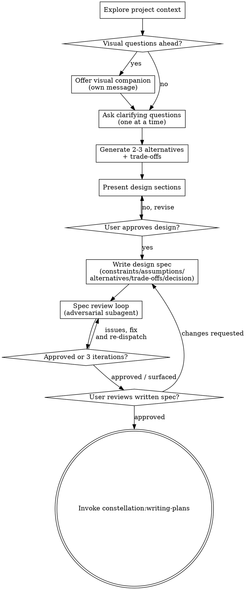

# Brainstorming Ideas Into Designs

Turn an idea into an approved, written design before any implementation begins. The body holds the gates — do not act on the trigger alone.

Announce at the start: "Using brainstorming to turn this idea into an approved design." Create a TodoWrite list from the Checklist below and work it in order.

```
THE GATE: No code, no scaffold, no implementation skill until a written design is approved.
```

This applies to EVERY project regardless of perceived simplicity. Violating the letter of the rules is violating the spirit of the rules — "I'll just sketch the file structure" or "I'll prototype to see what works" is implementing before approval.

## Anti-Pattern: "This Is Too Simple To Need A Design"

Every project goes through this process. A todo list, a one-function utility, a config change — all of them. "Simple" projects are where unexamined assumptions cause the most wasted work. The design can be a few sentences for a truly simple project, but you MUST write it and get approval.

## When to use

- About to write code, scaffold a project, or invoke an implementation skill for anything new.
- "How should we…", "what approach…", "which way…", "design X", "explore options".
- Before the Research phase, to clarify the question space.
- ESPECIALLY when the work feels obvious or the user wants it NOW — that pressure is exactly when skipped designs cost the most.

## When NOT to use

- A design is already approved and written — go to constellation:writing-plans (REQUIRED SUB-SKILL).
- Pure bug fix with a known root cause and no behavior change — use constellation:systematic-debugging.
- The change is config/docs only with no design decision.

## Excuse | Reality

| Excuse you'll tell yourself | Reality |
|---|---|
| "This is too simple to need a design." | Simple tasks hide the riskiest assumptions. Write three sentences and get approval. |
| "The user already told me what to build." | A request is not a design. Restate it, surface assumptions, confirm. |
| "I'll prototype first to understand it." | A prototype is implementation. Design first, then constellation:writing-plans. |
| "I'll just scaffold the directories while we talk." | Scaffolding is taking an implementation action before approval. Stop. |
| "Asking all my questions at once is faster." | Batched questions overwhelm and get half-answered. One question per message. |
| "I'll present one approach — it's clearly right." | Without alternatives you can't see the trade-off you're paying. Generate 2-3. |
| "The reviewer approved, ship it." | The user still must read the spec. Both gates are required. |
| "Design's approved, I'll jump straight to coding." | The only next step is constellation:writing-plans, never an implementation skill. |

## Red Flags — STOP

If you catch yourself thinking any of these, stop and return to the gate:

- "Let me just create the file/folder structure first."
- "I'll write a quick proof of concept."
- "This doesn't need a spec document."
- "I'll ask my five questions in one message."
- "There's only one reasonable approach."
- "I'll invoke frontend-design / the builder skill now."
- Reaching for Write/Edit on production files before the user approved a design.

## Checklist

Create a TodoWrite item for each and complete in order:

1. **Explore project context** — files, docs, recent commits, existing patterns.
2. **Offer the visual companion** (only if upcoming questions are genuinely visual) — its own message, no other content. See `references/visual-companion.md`.
3. **Ask clarifying questions** — one per message; purpose, constraints, success criteria.
4. **Generate 2-3 alternatives** — diverge first, evaluate second.
5. **Run trade-off analysis** — compare on the dimensions that matter; state a recommendation.
6. **Present the design** — in sections scaled to complexity; get approval after each section.
7. **Write the design spec** — constraints, assumptions, alternatives, trade-offs, decision; save and commit (durable artifact).
8. **Spec review loop** — dispatch the reviewer subagent; fix and re-dispatch until approved (max 3 iterations, then surface to human).
9. **User reviews the written spec** — wait for explicit approval; changes re-enter the loop.
10. **Hand off** — invoke constellation:writing-plans. No other skill.

## Process flow



The terminal state is invoking constellation:writing-plans. Do NOT invoke frontend-design, a builder, or any other implementation skill from here.

## The process

**Understanding the idea**
- Check current project state first (files, docs, recent commits).
- Assess scope before detail. If the request describes multiple independent subsystems (chat + storage + billing + analytics), flag it and decompose into sub-projects before refining any one. Each sub-project gets its own design → plan → implementation cycle.
- For an appropriately scoped project, ask one question per message. Prefer multiple choice; open-ended is fine.
- `references/design-prompts.md` has assumption-surfacing and decision-forcing templates.

**Generating alternatives** (do this before evaluating)
- Produce at least 3 meaningfully different approaches: the obvious one, the simplest (fewest moving parts), the most flexible (easiest to change later).
- For each: what it is, what it's optimized for, its main weakness.

**Trade-off analysis**
- Compare on the dimensions that matter (complexity, reversibility, performance, consistency, time to ship, test surface). Use the matrix in `references/design-prompts.md`.
- State a recommendation directly, no hedging: which option, the primary reason, the accepted trade-off, and what would make you revisit.

**Presenting the design**
- Once you understand what you're building, present it in sections scaled to complexity (a few sentences to ~300 words each). Ask after each section whether it's right.
- Cover architecture, components, data flow, error handling, testing.
- Design for isolation: each unit has one clear purpose, a well-defined interface, and can be understood and tested independently. If you can't change a unit's internals without breaking consumers, the boundaries need work.
- In existing codebases, follow existing patterns; include only targeted improvements that serve the current goal. No unrelated refactoring.

**Key principles**
- YAGNI ruthlessly — remove unnecessary features from every design.
- Incremental validation — approval after each section, not one big reveal at the end.
- Be flexible — go back and clarify when something doesn't fit.

## The durable artifact

A brainstorm always leaves a committed design spec. Save to `docs/specs/YYYY-MM-DD-<topic>-design.md` (user preference overrides the location) and commit it. Write the spec prose clearly and concisely. The spec MUST contain:

```markdown
# <Topic> Design

**Date:** YYYY-MM-DD
**Status:** Proposed | Accepted | Superseded

## Context
What problem are we solving and why now?

## Constraints
Hard limits the design must respect (time, cost, compatibility, reversibility).

## Assumptions
Each with risk: HIGH (wrong = wrong solution / data loss), MEDIUM (wrong = rework), LOW. Note how to verify HIGH ones.

## Alternatives Considered
1. <Option A> — what it is, optimized for, main weakness
2. <Option B> — …
3. <Option C> — …

## Trade-off Analysis
Comparison table across the dimensions that matter for this problem.

## Decision
Which option and why. Reference the trade-off analysis. State the accepted cost.

## Consequences
**Good / Bad / Neutral** — what gets better, harder, or just different.

## Design
Architecture, components, data flow, error handling, testing.
```

This block is both the spec and its decision record — it replaces a separate ADR.

## Spec review loop

After writing the spec, dispatch the reviewer subagent per `references/spec-document-reviewer-prompt.md`. The subagent gets the spec file path and an adversarial instruction — never your session history. If it returns Issues Found: fix, re-dispatch, repeat. After 3 iterations without approval, surface to the human for guidance instead of looping further.

Then the user-review gate:

> "Spec written and committed to `<path>`. Please review it and tell me if you want changes before we write the implementation plan."

Wait for the response. Changes re-enter the review loop. Proceed only on explicit approval.

## Good / bad pairs

✅ "Question 1 of a few: is this for internal users or external customers? (a) internal (b) external (c) both"
❌ "Is this internal or external, what's the scale, do you need auth, and should it be real-time or batch?"

✅ "I see three approaches: (1) polling — simplest, higher latency; (2) webhooks — low latency, needs a public endpoint; (3) a queue — most flexible, most infra. I recommend (1) because the latency budget is generous; revisit (3) if volume 10x's."
❌ "I'll use a queue — it's the standard solution." (no alternatives, no trade-off, no recommendation rationale)

✅ "Design approved and spec committed. Invoking constellation:writing-plans to produce the implementation plan."
❌ "Design approved — I'll start scaffolding the project now." (skips the gate and the plan)

✅ Spec includes a HIGH-risk assumption: "Assumes the upstream API returns sorted results — HIGH; verify with a probe before relying on it."
❌ Spec lists only the chosen design with no constraints, assumptions, or alternatives — nothing durable to revisit later.

## Integration

- **Called when:** any new feature/component/behavior work is about to start.
- **Hands off to (terminal):** constellation:writing-plans (REQUIRED SUB-SKILL) — the only skill invoked after brainstorming.
- **For product features started from requirements:** route through the PRD pipeline first via constellation:prd-author, then return here to design.
- **Background:** write the spec prose clearly and concisely.

## Visual companion (optional)

A browser-based companion for mockups, diagrams, and side-by-side visual options. It is a tool, not a mode — accepting it makes it available; you still decide per question whether seeing beats reading. Offer it only when upcoming questions are genuinely visual, and make the offer its own message. Read `references/visual-companion.md` before using it; scripts live in `scripts/`.

## References

- `references/design-prompts.md` — assumption surfacing, alternative generation, trade-off matrix, decision-forcing questions.
- `references/spec-document-reviewer-prompt.md` — adversarial reviewer dispatch template.
- `references/visual-companion.md` — browser companion guide.
