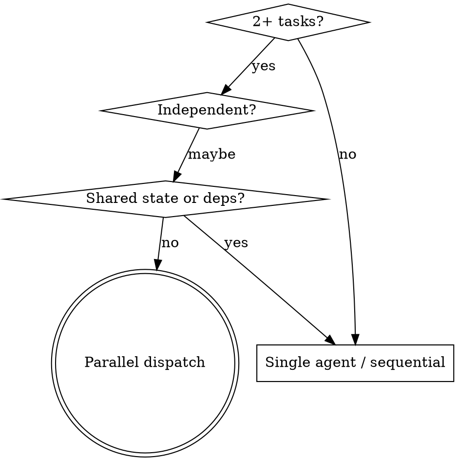

# Dispatching Parallel Agents

## Overview

Delegate each independent problem to its own subagent with a constructed, isolated context. Subagents never inherit your session history — you hand them exactly what they need and nothing else. This keeps each agent focused, prevents them from interfering, and preserves your own context for coordination.

This is the reference playbook for the dispatch mechanics that `constellation:orchestrate` (REQUIRED BACKGROUND) coordinates at scale.

**Core principle:** one agent per independent problem domain, running concurrently.

## The Independence Gate

Before dispatching, confirm BOTH:

1. **No shared state** — agents will not edit the same files, the same resources, or the same global state.
2. **No sequential dependency** — no agent needs another's output to start.

If either fails, do NOT parallelize.



**Don't parallelize when:** failures are related (one fix may resolve others), you don't yet know what's broken (exploratory), or agents would edit overlapping files.

## Dispatch Mechanics

- Use the `Task` tool; issue all `Task` calls in a single message so they run concurrently.
- `agentType`: use `Explore` or omit it. Do NOT use `general-purpose` (model error).
- Do NOT force `model: opus` — a forced model cascades restarts when that model is unavailable; let it default.
- Track every dispatched agent and the post-return conflict check as TodoWrite items so nothing is integrated unverified.
- Announce: "Using dispatching-parallel-agents to run N independent tasks in parallel."

## Writing the Agent Prompt

Every prompt is focused (one domain), self-contained (all context pasted in, never "read the plan"), constrained (what not to touch), and explicit about the return format.

Paste the actual error text and test names into the prompt — never make the subagent rediscover them.

For review or dispatch agents that inspect a PR, pin scope to the changed files only:

```
Review ONLY the files in this PR. Get the exact list with:
  gh pr diff --name-only
Do not review or comment on code outside that list, even if it looks related.
```

This stops agents from drifting into merged worktree code outside the diff.

### Good vs Bad prompts

❌ Too broad — agent gets lost:
```
Fix all the failing tests.
```
✅ Scoped to one domain:
```
Fix the 3 failing tests in src/agents/agent-tool-abort.test.ts.
```

❌ No context — agent must rediscover the problem:
```
Fix the race condition somewhere in the abort flow.
```
✅ Context pasted in:
```
These 3 tests fail in src/agents/agent-tool-abort.test.ts:
- "should abort tool with partial output capture" — expects 'interrupted at' in message
- "should handle mixed completed and aborted tools" — fast tool aborted instead of completed
- "should properly track pendingToolCount" — expects 3 results, gets 0
These are timing/race issues. Do NOT just increase timeouts — find the real cause.
Steps: read the test file, identify root cause, fix with event-based waiting or fix the bug.
Return: root cause found and exact changes made.
```

❌ No constraints — agent refactors everything:
```
Make the abort tests pass however you want.
```
✅ Constrained:
```
Fix tests only. Do NOT change production code outside src/agents/abort.ts.
```

❌ Vague output — you can't verify what changed:
```
Fix it and let me know.
```
✅ Fixed return format:
```
Return: (1) root cause in one sentence, (2) files changed with a one-line reason each,
(3) status: DONE / DONE_WITH_CONCERNS / BLOCKED.
```

## After Agents Return — Mandatory

Do not integrate on the agents' word. Run this before declaring success:

1. **Read each summary** — note every file each agent changed.
2. **Conflict check** — if two agents touched the same file, diff and reconcile by hand. Independent-by-design is an assumption until verified.
3. **Distrust optimistic reports** — agents that finished fast may be wrong; spot-check the actual diffs against requirements, and confirm tests drive the real code path, not fakes or injected state.
4. **Run the FULL suite** — not just the per-domain tests. Parallel fixes can pass in isolation and break together. You cannot claim green without running it in this message and seeing it pass.

```
✅ Ran the full suite after integration; output shows 0 failures — integrating.
❌ Each agent reported its tests pass, so the suite is green. (No combined run = not verified.)
```

## Integration with Other Skills

- REQUIRED BACKGROUND: `constellation:orchestrate` — coordinates multi-domain dispatch; this skill is its per-agent dispatch playbook.
- Pairs with `constellation:systematic-debugging` — use it to confirm each domain is genuinely independent before splitting.
- Pairs with `constellation:verification-before-completion` — the full-suite run above is the verification gate; do not skip it.
- On Codex, `Task` maps to `spawn_agent`; see the plugin's `skills/_shared/platform/codex-tools.md`.
