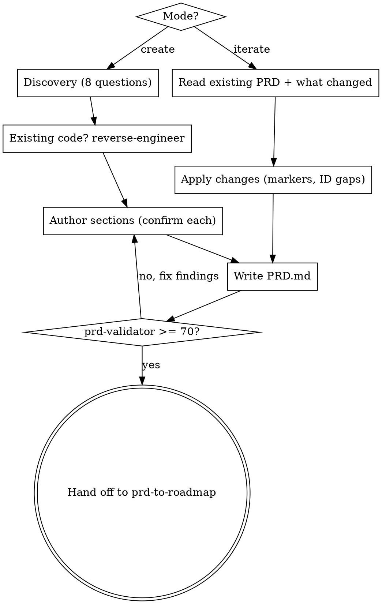

# PRD Author

Turn a product idea or stakeholder conversation into a structured, validated PRD that an engineer can plan against. A PRD describes WHAT the product must do and WHY — never HOW to build it.

Announce at the start: "Using prd-author to produce a validated PRD." Create a TodoWrite list from the active mode's checklist and work it in order.

## The two gates

This skill is flexible facilitation, but two gates are non-negotiable:

```
GATE 1 — Discovery before authoring (create mode): no PRD sections until the 8 discovery questions are answered or sourced.
GATE 2 — Validation before handoff: the PRD must score >= 70 via the bundled validator (run `references/prd-validator/scripts/validate_prd.py`; see `references/prd-validator/SKILL.md`) before it leaves this skill.
```

Skipping discovery produces a PRD that answers the wrong question. Skipping validation ships an untestable spec to engineering.

## The abstraction boundary (load-bearing)

A PRD describes observable behavior, not implementation. This is the most common failure and the easiest to slip into when you know the codebase.

Keep OUT of requirements (these belong in PLAN.md):
- File paths or directory structures (`src/components/foo.tsx`)
- Line numbers or code references
- Implementation patterns — hook names, event handlers, state management, type definitions
- "Files to change" / "Files to modify" sections
- Step instructions ("call X before Y", "use stopPropagation()")

Codebase context from discovery *informs* requirements but stays in DISCOVERY.md.

✅ "Tapping the heart icon on a target card toggles its favorite state without navigating away. Users can search by name and see results within 2 seconds."
❌ "Add a `useFavorite` hook in `src/cards/Card.tsx` (line 42); implement Elasticsearch fuzzy matching."

## When to use

- Starting a new product initiative from scratch.
- Translating stakeholder conversations into structured requirements.
- A non-technical user needs to define what to build.
- Updating an existing PRD after engineering, design, or stakeholder feedback.

## When NOT to use

- The PRD is already validated and you need to break it into phases — use the bundled roadmap stage (`references/prd-to-roadmap/`).
- You are designing a technical solution for an already-defined requirement — use constellation:brainstorming.
- The task is pure implementation against an approved plan.

## Excuse | Reality

| Excuse you'll tell yourself | Reality |
|---|---|
| "I already know the problem, I'll skip discovery." | Unstated stakes, non-goals, and constraints are exactly what derails PRDs. Run the 8 questions or cite where they're answered. |
| "I know the code, I'll put the file paths in the requirement." | File paths make the PRD a plan. Describe behavior; paths go to PLAN.md. |
| "The acceptance criteria are obvious." | If you can't demo it, an engineer can't build to it. Write observable, testable criteria. |
| "I'll skip non-goals — we'll just not build that." | Unwritten non-goals become scope creep. The Scope Boundary is one of the most important sections. |
| "It reads fine, I'll skip the validator." | 'Reads fine' is not >= 70. Run the bundled validator (`references/prd-validator/`); fix findings; re-run. |
| "I'll hand it to engineering now, validation can come later." | Later never comes. The validation gate is before handoff, not after. |

## Mode: Create

Checklist (one TodoWrite item each):

1. **Discovery** — ask the 8 questions from `references/discovery-questions.md`. One question per message. Do not write sections yet.
2. **Existing-context check** — if discovery Q8 reveals existing code, suggest a reverse-engineering pass over the existing code before authoring.
3. **Section authoring** — walk the PRD template section by section using `references/facilitation-prompts.md`; pre-fill from discovery answers; confirm each section before the next.
4. **Write** the PRD to `PRD.md` (or the user-specified path) using `references/prd-template.md`.
5. **Validate** — run `references/prd-validator/scripts/validate_prd.py` (see `references/prd-validator/SKILL.md`). If NEEDS WORK (< 70), fix the findings and re-validate. Repeat until PASS.

### Discovery questions (Phase 1)

The 8 questions surface assumptions, stakes, and scope upfront. Each maps to a PRD section (mapping table in `references/discovery-questions.md`):

1. The Problem — stated without a solution.
2. The Stakes — cost of doing nothing.
3. Prior Art — what's been tried and why it failed.
4. Stakeholders — input vs. veto power.
5. Constraints — timeline, budget, team, technology, compliance.
6. Success Definition — concrete, measurable change.
7. Non-Goals — what to resist building.
8. Existing Context — code/process to reverse-engineer first.

If the user already documented answers (brief, Slack thread, prior PRD), reference those rather than re-asking.

### Section authoring (Phase 2)

Author in order, using discovery answers as input: Problem Statement, User Personas, Functional Requirements (each with ID, description, priority, acceptance criteria), Non-Functional Requirements, Scope Boundary, Milestones/Phases, Success Metrics, Dependencies, Open Questions. Confirm each section before moving on.

Milestones must each ship a usable, user-visible capability — avoid phases that are only backend work with nothing a real user could try.

## Mode: Iterate

Update an existing PRD per `references/iteration-guide.md`. Checklist:

1. **Read** the existing PRD.
2. **Ask what changed** — new requirements, scope shifts, reprioritization, engineering feedback.
3. **Apply** changes using the guide's conventions — change markers (`[ADDED]`, `[MODIFIED]`, `[REMOVED]`, `[SPLIT]`, `[MERGED]`), keep ID gaps (never renumber).
4. **Write** the updated PRD.
5. **Re-validate** — run the bundled validator (`references/prd-validator/`). If a previously passing PRD now fails, the iteration introduced a gap; address it before handoff.

Skip discovery when iterating — it was answered in the original authoring session.

## Process flow



## Good / bad pairs

✅ "Discovery question 1 of 8: what problem are we solving — described without any solution?"
❌ Jumping straight to "Here's the PRD I drafted" before asking anything.

✅ "FR-003 Acceptance: a user searching by partial name sees matching results within 2 seconds." (observable, demoable)
❌ "FR-003: implement fuzzy search." (no observable done-state)

✅ "PRD scored 82 on the validator. Handing off to the roadmap stage (`references/prd-to-roadmap/`)." (gate cleared)
❌ "PRD looks complete, sending to engineering." (no validation run)

## Integration

- **Pipeline:** prd-author -> `references/prd-validator/` (>= 70 gate) -> `references/prd-to-roadmap/`. Do not skip the validator; do not hand a sub-70 PRD downstream.
- **Roadmaps name features, not PRs.** The roadmap stage produces phased *feature* descriptions; PR decomposition happens later at slice-spec time, not in the PRD or the roadmap.
- **Upstream (optional):** a reverse-engineering pass when existing code should seed requirements.
- **Sibling:** for designing a technical solution to a defined requirement, use constellation:brainstorming.

## References

- `references/discovery-questions.md` — the 8 pre-authoring questions and their section mapping.
- `references/facilitation-prompts.md` — plain-language prompts for each PRD section.
- `references/prd-template.md` — canonical PRD format with all required sections and the abstraction boundary.
- `references/iteration-guide.md` — updating an existing PRD (add, revise, reprioritize, split, merge).
