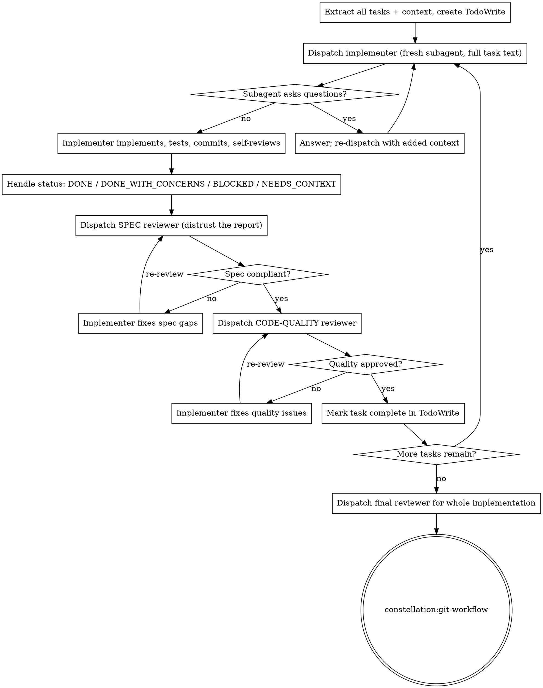

# Subagent-Driven Development

Execute a plan by dispatching a fresh subagent per task, each followed by
two-stage review: spec compliance FIRST, then code quality. The controller
constructs each subagent's context from scratch and never lets it inherit session
history.

## The Iron Law

```
EVERY TASK GETS A FRESH SUBAGENT WITH CONSTRUCTED CONTEXT,
SPEC-COMPLIANCE REVIEW BEFORE CODE-QUALITY REVIEW, AND BOTH
GREEN BEFORE THE NEXT TASK STARTS.
```

No exceptions. Don't reuse a polluted context, don't reorder the reviews, don't
advance with an open issue.

**Violating the letter of the rules is violating the spirit of the rules.**

If you find yourself rationalizing "this task is small enough to just do inline"
or "I'll batch the reviews at the end," you are violating the law. Stop.

## When to Use

- You have an approved implementation plan with mostly-independent tasks.
- You want to stay in the current session (no parallel-session handoff).
- You want automatic per-task review checkpoints without waiting on a human.

## When NOT to Use

- Tasks are tightly coupled → execute manually or re-plan into independent slices.
- You want parallel sessions instead of same-session → use
  constellation:subagent-driven-development.
- No plan exists yet → use constellation:brainstorming then constellation:writing-plans first.

## Required setup before the first task

- Set up an isolated workspace — REQUIRED SUB-SKILL: constellation:git-workflow.
- Branch check: never start implementation on main/master without explicit user consent.
- Read the plan ONCE. Extract every task's full text and context. Create a TodoWrite
  with one item per task. (Checklists without TodoWrite tracking get skipped. Every time.)
- Announce: "Using subagent-driven-development to execute [plan]."

## The Process



Review/fix loops run max 3 iterations per stage. If a reviewer still finds issues
after 3, surface to the human — do not thrash.

## Constructed context, never inherited

The subagent gets exactly what you paste into its prompt — never your session
history. Isolation prevents context pollution, preserves your controller budget,
and lets reviewers judge the work product rather than the reasoning that produced it.

✅ Good: paste the task's full text and scene-setting context into the prompt.
❌ Bad: "Read docs/plans/feature-plan.md, Task 3, and implement it."

✅ Good: dispatch each task on a clean subagent.
❌ Bad: continue task 4 on the same subagent that did task 3 (carries stale assumptions).

## Dispatch mechanics (workspace constraint)

- Dispatch with the `Task` tool, one implementer at a time (parallel implementers conflict).
- When dispatched via the `Workflow` tool, set `agentType` to Explore or omit it —
  NEVER `general-purpose` (it raises a model error). Do not force `model: opus`.
- Pin every reviewer's scope to the diff: `gh pr diff --name-only` (or
  `git diff --name-only BASE_SHA HEAD_SHA`). Without a pinned scope, reviewers
  drift to unrelated merged code.
- On Codex, `Task` maps to `spawn_agent`; see `_shared/platform/codex-tools.md`.

## Model selection

Use the least powerful model that can handle each role.

| Signal | Model tier |
|--------|-----------|
| Touches 1-2 files, complete spec, mechanical | fast/cheap |
| Multiple files, integration concerns, debugging | standard |
| Architecture, design judgment, broad codebase understanding, review | most capable |

## Handling implementer status

Implementers report exactly one of four statuses.

| Status | Action |
|--------|--------|
| DONE | Proceed to spec-compliance review. |
| DONE_WITH_CONCERNS | Read the concerns first. If correctness/scope, address before review; if observation (e.g. "file getting large"), note and proceed. |
| NEEDS_CONTEXT | Provide the missing context, re-dispatch. |
| BLOCKED | Diagnose: context problem → add context, re-dispatch same model; needs more reasoning → re-dispatch more capable model; too large → split; plan is wrong → escalate to human. |

**Never force the same model to retry without changing something.** If the
implementer said it's stuck, something must change — more context, a bigger model,
a smaller task, or human input.

## Verification gate

- The implementer must paste real test output, not "tests should pass."
- The spec reviewer must read the actual code, not trust the report.
- Tests must drive the REAL code path — fakes or injected state standing in for the
  behavior under test produce false-greens. The reviewer checks this explicitly.

## Excuse | Reality

| Excuse | Reality |
|--------|---------|
| "This task is tiny, I'll just do it inline." | Inline work pollutes your controller context and skips both reviews. Dispatch it. |
| "I'll run all the reviews at the end." | Batched review can't catch a wrong-direction task until it's compounded. Review per task. |
| "Spec and quality are basically the same review." | Quality-first polishes the wrong feature. Spec confirms you built the right thing FIRST. |
| "The implementer's report says it's done, that's enough." | Reports are optimistic and sometimes false. The reviewer must verify by reading code. |
| "It's close enough on spec, I'll let quality review catch the rest." | Spec reviewer found issues = not done. No advancing to quality with open spec gaps. |
| "The subagent is stuck; let me just re-run it." | Same model + same context = same failure. Change something or escalate. |
| "I'll let the subagent read the plan file to save me pasting." | Inherited/fetched context drifts and burns budget. Construct the prompt. |
| "Self-review by the implementer covers it." | Self-review and independent review catch different classes of defect. Both are required. |

## Red Flags — STOP

If you catch yourself thinking any of these, stop and follow the law:

- "I'll just implement this one task myself."
- "Let me batch the reviews after a few tasks."
- "Code quality looks fine, I'll skip the spec check."
- "The report looks thorough, I trust it."
- "Close enough — I'll move to the next task."
- "Let me re-dispatch the blocked subagent unchanged."
- "I'll have the subagent read the plan instead of pasting the task."
- "I'll dispatch task 2 and task 3 implementers in parallel."
- "We're on main but it's a quick change."

## Persuasion hygiene

Reviewer and implementer prompts must stay adversarial and neutral. Do not thank
subagents or tell them "you're absolutely right" — flattery induces sycophancy and
degrades honest feedback.

## Prompt templates

- `references/implementer-prompt.md` — dispatch the implementer subagent
- `references/spec-reviewer-prompt.md` — dispatch the spec-compliance reviewer
- `references/code-quality-reviewer-prompt.md` — dispatch the code-quality reviewer

## Integration

- REQUIRED SUB-SKILL: constellation:git-workflow — isolate the workspace before starting.
- REQUIRED SUB-SKILL: constellation:code-review — template the code-quality reviewer uses.
- REQUIRED BACKGROUND: constellation:test-driven-development — subagents follow RED-GREEN-REFACTOR per task.
- Upstream (creates the plan): constellation:writing-plans.
- Downstream (after all tasks pass): constellation:git-workflow.
- Alternative (parallel session instead of same-session): constellation:subagent-driven-development.
