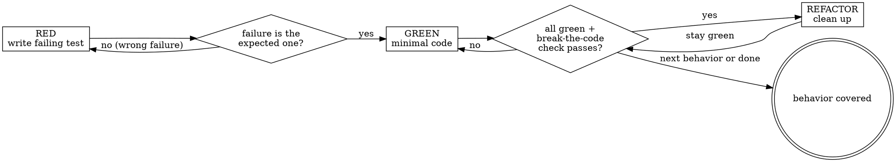

# Test-Driven Development

## Overview

Write the test first. Watch it fail. Write the minimal code to pass.

**Core principle:** If you did not watch the test fail against the real code, you do not know whether it tests anything.

**Violating the letter of the rules is violating the spirit of the rules.**

This is a rigid discipline skill. Follow it exactly. Do not adapt away the discipline — its entire value is resisting the rationalizations you will reach for under pressure.

## The Iron Law

```
NO PRODUCTION CODE WITHOUT A FAILING TEST FIRST
```

Wrote code before the test? Delete it. Start over.

- Do not keep it "as reference."
- Do not "adapt" it while writing the test.
- Do not look at it.
- Delete means delete.

Implement fresh from the test. No exceptions without the user's explicit permission.

## When to Use

**Always:** new features, bug fixes, behavior changes, refactoring of observable behavior.

**Exceptions (ask the user first):** throwaway prototypes, generated code (protobuf/ORM/OpenAPI output), pure configuration/docs.

Use this **especially** when under time pressure, when the manager wants it NOW, or when you "already know" the code is right. Those are the moments the discipline pays for itself.

Thinking "skip TDD just this once"? Stop. That is the rationalization the next section was built to catch.

## Before you start

1. Announce: "Using test-driven-development to implement [behavior]."
2. Detect the test runner — do not assume `npm test`:

   | Project file | Default command |
   |---|---|
   | `package.json` | `npm test` (check `scripts.test`) |
   | `pyproject.toml` | `pytest` |
   | `go.mod` | `go test ./...` |
   | `Cargo.toml` | `cargo test` |
   | `Makefile` | `make test` |
   | `Taskfile.yml` | `task test` |

   If unclear, ask — do not guess.
3. Add each verification-checklist item (end of this skill) to TodoWrite. Checklists without TodoWrite tracking get skipped. Every time.

## Red-Green-Refactor



### RED — write one failing test

One behavior. Clear name describing the behavior. Real code paths. Write the test as if the production API already exists.

<Good>
```typescript
test('retries failed operations 3 times', async () => {
  let attempts = 0;
  const operation = () => {
    attempts++;
    if (attempts < 3) throw new Error('fail');
    return 'success';
  };

  const result = await retryOperation(operation);

  expect(result).toBe('success');
  expect(attempts).toBe(3);
});
```
Clear name, drives real behavior, asserts the outcome.
</Good>

<Bad>
```typescript
test('retry works', async () => {
  const mock = jest.fn()
    .mockRejectedValueOnce(new Error())
    .mockRejectedValueOnce(new Error())
    .mockResolvedValueOnce('success');
  await retryOperation(mock);
  expect(mock).toHaveBeenCalledTimes(3);
});
```
Vague name, asserts on the mock instead of the code's behavior.
</Bad>

### Verify RED — watch it fail (MANDATORY, never skip)

Run the test. Confirm:

- It **fails** — not errors. A syntax/import error is not a valid RED; fix that, then re-run until it fails for the right reason.
- The failure message matches the **missing behavior**.

**Test passes with no implementation?** You are testing existing behavior. Revise the test.

### GREEN — minimal code

Simplest code that passes. Hardcoding a return to pass one test is fine — the next test forces real logic.

<Good>
```typescript
async function retryOperation<T>(fn: () => Promise<T>): Promise<T> {
  for (let i = 0; i < 3; i++) {
    try { return await fn(); }
    catch (e) { if (i === 2) throw e; }
  }
  throw new Error('unreachable');
}
```
Just enough to pass.
</Good>

<Bad>
```typescript
async function retryOperation<T>(
  fn: () => Promise<T>,
  options?: { maxRetries?: number; backoff?: 'linear' | 'exponential'; onRetry?: (n: number) => void }
): Promise<T> { /* ... */ }
```
Over-engineered. YAGNI. The test required none of this.
</Bad>

### Verify GREEN — watch it pass (MANDATORY)

Run the full suite. Confirm: new test passes, all other tests still pass, output is pristine (no warnings/errors).

**New test fails?** Fix the code, not the test. **Other tests fail?** Fix the regression now.

### Verify the test is real — break-the-code check (MANDATORY)

A passing test proves nothing until you have seen it fail against the real implementation. Tests written before the code give you that for free in RED — but mocks, fakes, and injected state can make a test pass without ever running the production path (the dominant false-green failure mode).

Prove the test is load-bearing:

1. Introduce one deliberate defect in the production code the test claims to exercise — invert a condition, return a wrong constant, delete a line.
2. Re-run the test. It MUST fail.
3. Revert the defect. Re-run. It MUST pass.

If the test stays green while the code is broken, it is testing a fake/mock/injected state, not the code. Rewrite it to drive the real path before continuing. See `references/testing-anti-patterns.md`.

### REFACTOR — clean up

Only after green: remove duplication, improve names, extract helpers. No new behavior — new behavior needs a new RED. Re-run the suite; stay green.

### Repeat

Next failing test for the next behavior.

## Common Rationalizations

| Excuse | Reality |
|---|---|
| "Too simple to test." | Simple code breaks. The test takes 30 seconds. |
| "I'll write the tests after." | Tests written after pass by construction. Passing immediately proves nothing. |
| "Tests after achieve the same goals — it's spirit not ritual." | Tests-after answer "what does this do?"; tests-first answer "what should this do?" You verify remembered cases, not discovered ones. |
| "I already manually tested it." | Ad-hoc, no record, does not run on CI, cannot catch regressions. |
| "Deleting X hours of work is wasteful." | Sunk cost. The hours are gone. Unverified code you cannot trust is the liability, not the asset. |
| "Keep it as reference while I write tests." | You will adapt it — that is testing after. Delete means delete. |
| "I need to explore first." | Fine. Spike it, then throw the spike away and start with TDD. |
| "This code is hard to test." | Hard to test = hard to use. Listen to the test; fix the design. |
| "Mocking everything is easier." | Then you are testing mocks. Test the real path; mock only external I/O. |
| "TDD will slow me down." | TDD is faster than debugging in production. Pragmatic = test-first. |
| "It's just a refactor / a rename." | Refactoring without tests is rewriting. Write characterization tests first. |
| "The test framework isn't set up." | Set it up. Skipping it is deferred cost with interest. |
| "This is different because…" | It is not. Start over with TDD. |

## Red Flags — STOP and start over

- Production code before any test.
- Test written after the implementation.
- Test passes immediately (you never saw it fail).
- You cannot explain why the test failed in RED.
- The break-the-code check leaves the test green.
- Tests mock so much that no real code path runs.
- You ran the suite once, at the end, to confirm everything passes.
- Any sentence beginning "I'll just…", "Keep as reference", "I already manually tested", "It's spirit not ritual", "Already spent X hours", "TDD is dogmatic", or "This is different because…".

**All of these mean: delete the production code, start over with TDD.**

## When Stuck

| Problem | Solution |
|---|---|
| Don't know how to test it | Write the wished-for API in the test. Write the assertion first. Ask the user. |
| Test needs huge setup | The code does too much. Split it; test smaller units. |
| Must mock everything | Code too coupled. Use dependency injection; extract pure logic and test that. |
| Test passes immediately | It is not targeting missing behavior. Assert something that cannot be true without the implementation. |
| Mock depth keeps growing | Stop — you are testing mocks. Extract a pure function and test it directly. |
| Existing tests break | Run the full suite before and after each change; isolate and fix the regression first. |

## Bug fixes

A bug means a missing test. Use `constellation:systematic-debugging` (REQUIRED SUB-SKILL) to find the root cause first, then reproduce it as a failing test, then follow RED-GREEN-REFACTOR. The test proves the fix and prevents regression. Never fix a bug without a test that fails before the fix.

## Verification Checklist

Before marking work complete (track each as a todo):

- [ ] Every new function/method has at least one test
- [ ] Watched each test fail (RED) before implementing
- [ ] Each failure was for the expected reason (missing behavior, not a typo/import error)
- [ ] Wrote minimal code to pass each test
- [ ] Full suite passes — not just the new tests
- [ ] Output pristine (no errors, no warnings)
- [ ] Tests drive real code paths; mocks only for external I/O
- [ ] Break-the-code check passed: breaking the production code made a test fail, then reverted
- [ ] Edge cases and error paths covered (empty inputs, boundaries, null/nil/undefined)

Can't check all boxes? You skipped TDD. Start over.

Standalone copy: `references/verification-checklist.md`.

## Integration

- **Pairs with `constellation:code-review`** — after green, request review before committing; the false-green countermeasure here is what makes the review trustworthy.
- **Pairs with `constellation:subagent-driven-development`** — when delegating implementation to a subagent, the subagent runs this cycle.
- **Enforced by the `tdd-enforcer` agent** (`agents/tdd-enforcer.md`) — dispatch it to run and gate RED-GREEN-REFACTOR inside a subagent, including the break-the-code check, with a fixed per-cycle report format. Use it when TDD discipline must be guaranteed in delegated work.
- **REQUIRED BACKGROUND when writing or changing tests:** `references/testing-anti-patterns.md` — false-green, mock forests, tautology tests, and the gate functions that catch them.

## References

- `references/testing-anti-patterns.md` — anti-pattern catalog, gate functions, break-the-code check.
- `references/tdd-cycle-examples.md` — full RED-GREEN-REFACTOR examples in TypeScript, Python, and Go.
- `references/verification-checklist.md` — standalone checklist to fill in per task.

Tool names are Claude Code; on Codex see `skills/_shared/platform/codex-tools.md`.
