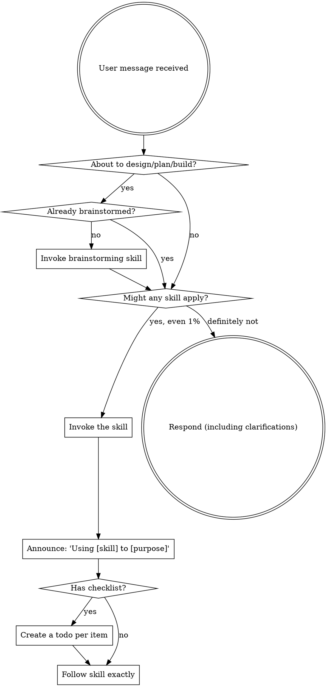

<SUBAGENT-STOP>
If you were dispatched as a subagent to execute a specific task, skip this skill.
</SUBAGENT-STOP>

<EXTREMELY-IMPORTANT>
If you think there is even a 1% chance a skill might apply to what you are doing, you ABSOLUTELY MUST invoke the skill.

IF A SKILL APPLIES TO YOUR TASK, YOU DO NOT HAVE A CHOICE. YOU MUST USE IT.

This is not negotiable. You cannot rationalize your way out of it. If an invoked skill turns out to be wrong for the situation, you don't need to use it — checking is cheap, skipping is not.
</EXTREMELY-IMPORTANT>

## Instruction priority

1. **User's explicit instructions** (CLAUDE.md, AGENTS.md, direct requests) — highest priority.
2. **Constellation skills** — override default system behavior where they conflict.
3. **Default system prompt** — lowest priority.

If the user's instructions conflict with a skill, follow the user. The user is in control.

## How to access skills

Never read skill files manually with file tools — use your platform's skill loader so the skill activates.

- **Claude Code:** use the `Skill` tool. Slash commands map to skills.
- **Codex:** skills load natively from `~/.agents/skills/`; follow the instructions presented. For tool-name differences, consult `skills/_shared/platform/codex-tools.md`.

The full catalog of available skills is in `CATALOG.md` at the plugin root — consult it when deciding what applies. It is generated from the `skills/` directory, so it always reflects what is installed.

## The rule

**Invoke relevant or requested skills BEFORE any response or action** — even a 1% chance means check.

## Red flags — these thoughts mean STOP, you're rationalizing

| Thought | Reality |
|---------|---------|
| "This is just a simple question" | Questions are tasks. Check for skills. |
| "I need more context first" | Skill check comes BEFORE clarifying questions. |
| "Let me explore the codebase first" | Skills tell you HOW to explore. Check first. |
| "I'll just do this one thing first" | Check BEFORE doing anything. |
| "The skill is overkill" | Simple things become complex. Use it. |
| "I remember this skill" | Skills evolve. Read the current version. |
| "This doesn't count as a task" | Action = task. Check for skills. |

## Skill priority

1. **Process skills first** (brainstorming, systematic-debugging, the discover-plan-implement workflow) — these decide HOW to approach the task.
2. **Implementation skills second** (code-review, design, infra) — these guide execution.

"Let's build X" → brainstorming, then planning, then implementation skills.
"Fix this bug" → systematic-debugging first, then domain skills.

## Skill types

- **Rigid** (test-driven-development, systematic-debugging, verification-before-completion): follow exactly. Do not adapt away discipline.
- **Flexible** (patterns, design heuristics): adapt principles to context.

Each skill states which it is.

## This workspace's standing rules (always on)

- **Discover → Plan → Implement** with an explicit approval gate; PLAN must pass `plan-validator` (PASS ≥ 70) before being shown. Maintain `.ai/sessions/<date>_<TICKET>_<slug>/` docs automatically.
- **Verify by running**, not by reasoning: no completion claim without fresh in-message evidence.
- Concise output, one insight per line, no filler. Include a confidence level when it adds signal.
- Never use the section-sign character — write the word "section".
- Personas apply to live conversation only, never to files committed to repos.
- Git safety: branch check before edits; never push to main/master without approval; never commit secrets.

## Announce

When you invoke a skill, say "Using [skill] to [purpose]" so the step is visible and tracked.
